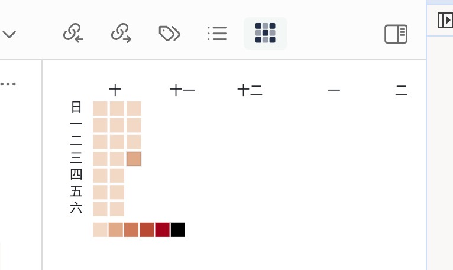

## Obsidian 插件 每日字数统计v1.0.5 :memo:

 

### 插件功能 :rosette:

- 字数基本统计
- 底部状态栏显示  
- 字数热力图

### 未来特性 :rocket:
  
- [ ] 自定义颜色支持
- [ ] 自定义时间段支持
- [ ] 自定义字数阈值支持
- [ ] 自定义字数统计方式支持
  
- [ ] 更好的显示效果
- [ ] 支持切换周启始日（周一/周日）
- [ ] 分文章字数统计

### 使用方法 :bulb:

目前还未发布到插件商店，可以通过手动安装的方式安装插件。

发布页面找到最新版本下载后，解压到`<vault>/.obsidian/plugins/`目录下，重启Obsidian启动插件即可

### 更新日志 :bookmark_tabs:

- v1.0.5 :egg:
  - 更换了日历插件依赖
  - 优化了代码结构
  - 修改了状态栏显示方式

